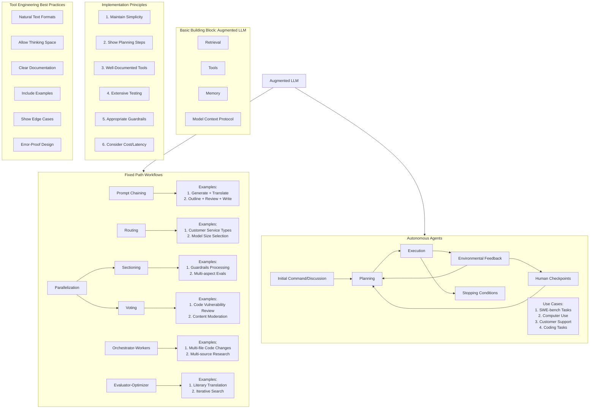

```mermaid
graph TD
    %% Core Components
    LLM[Augmented LLM] --> Workflows[Workflows]
    LLM --> Agents[Autonomous Agents]
    
    %% Augmented LLM Components
    subgraph Augmentations[Basic Building Block: Augmented LLM]
        Retrieval[Retrieval]
        Tools[Tools]
        Memory[Memory]
        API[Model Context Protocol]
    end

    %% Workflow Patterns
    subgraph Workflows[Fixed Path Workflows]
        Chain[Prompt Chaining]
        Route[Routing]
        Parallel[Parallelization]
        Orchestra[Orchestrator-Workers]
        Eval[Evaluator-Optimizer]

        %% Chain Details
        Chain --> ChainEx[Examples:<br/>1. Generate + Translate<br/>2. Outline + Review + Write]

        %% Route Details
        Route --> RouteEx[Examples:<br/>1. Customer Service Types<br/>2. Model Size Selection]

        %% Parallelization Types
        Parallel --> Section[Sectioning]
        Parallel --> Vote[Voting]
        Section --> SecEx[Examples:<br/>1. Guardrails Processing<br/>2. Multi-aspect Evals]
        Vote --> VoteEx[Examples:<br/>1. Code Vulnerability Review<br/>2. Content Moderation]

        %% Orchestra Details
        Orchestra --> OrcEx[Examples:<br/>1. Multi-file Code Changes<br/>2. Multi-source Research]

        %% Eval Details
        Eval --> EvalEx[Examples:<br/>1. Literary Translation<br/>2. Iterative Search]
    end

    %% Agent Pattern
    subgraph Agents[Autonomous Agents]
        Init[Initial Command/Discussion]
        Plan[Planning]
        Execute[Execution]
        Feedback[Environmental Feedback]
        Human[Human Checkpoints]
        Stop[Stopping Conditions]

        Init --> Plan
        Plan --> Execute
        Execute --> Feedback
        Feedback --> Plan
        Feedback --> Human
        Human --> Plan
        Execute --> Stop

        %% Agent Examples
        AgentEx[Use Cases:<br/>1. SWE-bench Tasks<br/>2. Computer Use<br/>3. Customer Support<br/>4. Coding Tasks]
    end

    %% Key Principles
    subgraph Principles[Implementation Principles]
        Simple[1. Maintain Simplicity]
        Transparent[2. Show Planning Steps]
        Interface[3. Well-Documented Tools]
        Test[4. Extensive Testing]
        Guard[5. Appropriate Guardrails]
        Cost[6. Consider Cost/Latency]
    end

    %% Tool Engineering
    subgraph ToolDesign[Tool Engineering Best Practices]
        Format[Natural Text Formats]
        Think[Allow Thinking Space]
        Doc[Clear Documentation]
        Examples[Include Examples]
        Edge[Show Edge Cases]
        Poka[Error-Proof Design]
    end
``` 