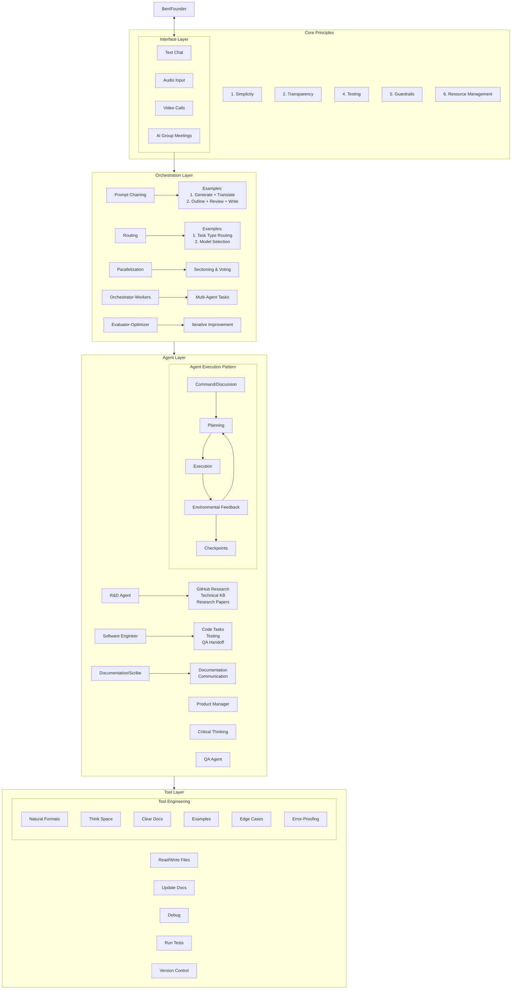

```mermaid
graph TD
    %% Top Level System Flow
    Ben[Ben/Founder] <--> Interface[Interfaces]
    Interface --> Orchestrator[AI Orchestrator]
    Orchestrator --> AgentLayer[AI Agents Layer]
    AgentLayer --> ToolLayer[Tools Layer]

    %% Interface Components
    subgraph Interface[Interface Layer]
        Text[Text Chat]
        Audio[Audio Input]
        Video[Video Calls]
        Meetings[AI Group Meetings]
    end

    %% Orchestrator Patterns
    subgraph Orchestrator[Orchestration Layer]
        %% Core Patterns
        Chain[Prompt Chaining]
        Route[Routing]
        Parallel[Parallelization]
        Orchestra[Orchestrator-Workers]
        Eval[Evaluator-Optimizer]

        %% Pattern Details
        Chain --> ChainEx[Examples:<br/>1. Generate + Translate<br/>2. Outline + Review + Write]
        Route --> RouteEx[Examples:<br/>1. Task Type Routing<br/>2. Model Selection]
        Parallel --> ParallelTypes[Sectioning & Voting]
        Orchestra --> OrcEx[Multi-Agent Tasks]
        Eval --> EvalEx[Iterative Improvement]
    end

    %% Agent Implementation
    subgraph AgentLayer[Agent Layer]
        %% Our Agents
        RD[R&D Agent]
        PM[Product Manager]
        Doc[Documentation/Scribe]
        SWE[Software Engineer]
        Critical[Critical Thinking]
        QA[QA Agent]

        %% Agent Tasks
        RD --> RD_Tasks[GitHub Research<br/>Technical KB<br/>Research Papers]
        SWE --> SWE_Flow[Code Tasks<br/>Testing<br/>QA Handoff]
        Doc --> Doc_Tasks[Documentation<br/>Communication]
        
        %% Agent Pattern
        subgraph AgentPattern[Agent Execution Pattern]
            Init[Command/Discussion]
            Plan[Planning]
            Execute[Execution]
            Feedback[Environmental Feedback]
            Human[Checkpoints]
            
            Init --> Plan
            Plan --> Execute
            Execute --> Feedback
            Feedback --> Plan
            Feedback --> Human
        end
    end

    %% Tools Implementation
    subgraph ToolLayer[Tool Layer]
        %% Core Tools
        FileIO[Read/Write Files]
        Docs[Update Docs]
        Debug[Debug]
        Tests[Run Tests]
        Commit[Version Control]

        %% Tool Best Practices
        subgraph ToolDesign[Tool Engineering]
            Format[Natural Formats]
            Think[Think Space]
            Clear[Clear Docs]
            Examples[Examples]
            Edge[Edge Cases]
            Poka[Error-Proofing]
        end
    end

    %% System Principles
    subgraph Principles[Core Principles]
        Simple[1. Simplicity]
        Transparent[2. Transparency]
        Interface[3. Tool Design]
        Test[4. Testing]
        Guard[5. Guardrails]
        Cost[6. Resource Management]
    end
``` 