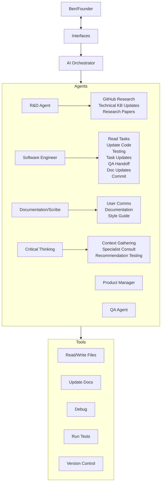

```mermaid
graph TD
    Ben[Ben/Founder] <--> Interfaces[Interfaces]
    Interfaces --> Orchestrator[AI Orchestrator]
    Orchestrator --> Agents[AI Agents]
    Agents --> Tools[Tools/Actions]

    subgraph Agents
        RD[R&D Agent]
        PM[Product Manager]
        Doc[Documentation/Scribe]
        SWE[Software Engineer]
        Critical[Critical Thinking]
        QA[QA Agent]

        RD --> RD_Tasks[GitHub Research<br/>Technical KB Updates<br/>Research Papers]
        
        SWE --> SWE_Flow[Read Tasks<br/>Update Code<br/>Testing<br/>Task Updates<br/>QA Handoff<br/>Doc Updates<br/>Commit]
        
        Doc --> Doc_Tasks[User Comms<br/>Documentation<br/>Style Guide]
        
        Critical --> Critical_Flow[Context Gathering<br/>Specialist Consult<br/>Recommendation Testing]
    end

    subgraph Tools
        FileIO[Read/Write Files]
        Docs[Update Docs]
        Debug[Debug]
        Tests[Run Tests]
        Commit[Version Control]
    end
``` 