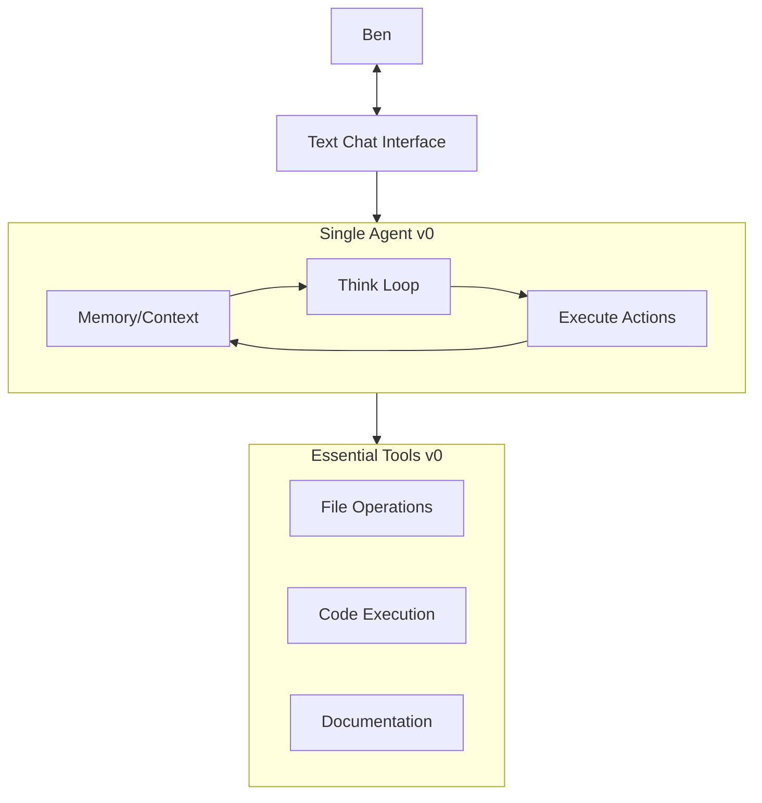

## Version 0 Scope

### Interface
- Text chat only
- Command triggers for different modes
- Basic error handling

### Core Agent
- Single agent with memory context
- Think-Execute loop
- Basic task planning

### Essential Tools
- File read/write
- Code execution
- Documentation updates

## Not Included in v0
- Multiple agents
- Orchestration
- Advanced interfaces
- Complex workflows 